# Tutorial: Create your first Wix application on your machine
In this tutorial we go over how to create a Wix application that interacts with the Wix platform that you will can submit to the Wix App Market, where Wix site owners can deploy it on their sites.   
## 1. Set up your app in a Wix Developers account 
A. Log in (or sign up) to [Wix Developers](https://dev.wix.com/).

B. Click 

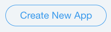

You should get this screen:

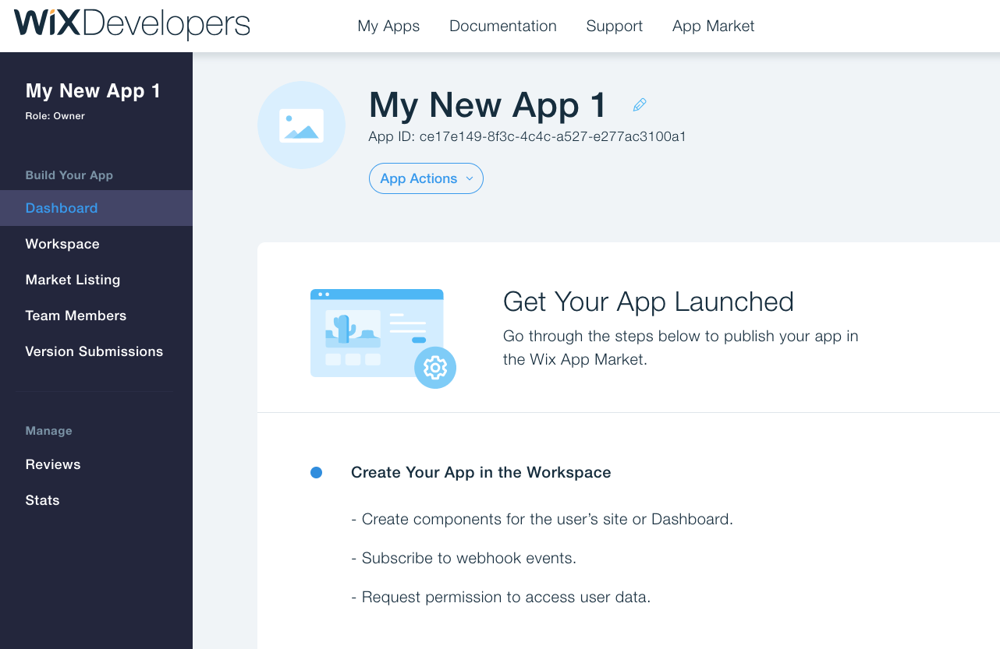

C. Go to Workspace > OAuth and copy your `App ID` and `App Secret Key`. You will need them later.
 
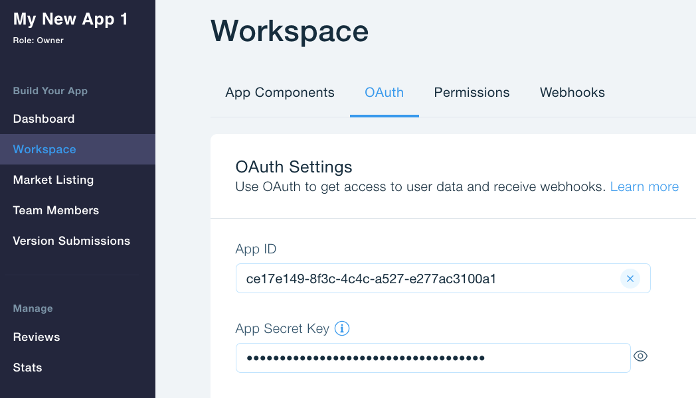

## 2. Set up the application to receive inbound HTTPS connections
Since most developers machine are not open for inbound connection and don't have HTTPS certificates, we will describe the process using **ngrok**.
(If you are hosting your application on a server without these restrictions, you can skip this step.)

Install and run [ngrok](https://dashboard.ngrok.com/get-started)

**Note:** Start an HTTP tunnel on the port your app is listening on  (default is 3000)
You should get something like this:

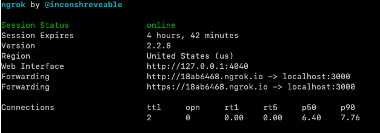

**Don't close the ngrok process** - You will need it running for the entire process.

## 3. Set up your application URLs
A. Go to Workspace > OAuth
B. In **`Redirect URL`** enter: `https://<12345678>.ngrok.io/login`
C. In **`App URL`** enter: `https://<12345678>.ngrok.io/signup`  
**Remember to replace '12345678' with ** your ngrok string you got above.**
for example:

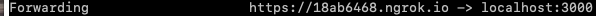

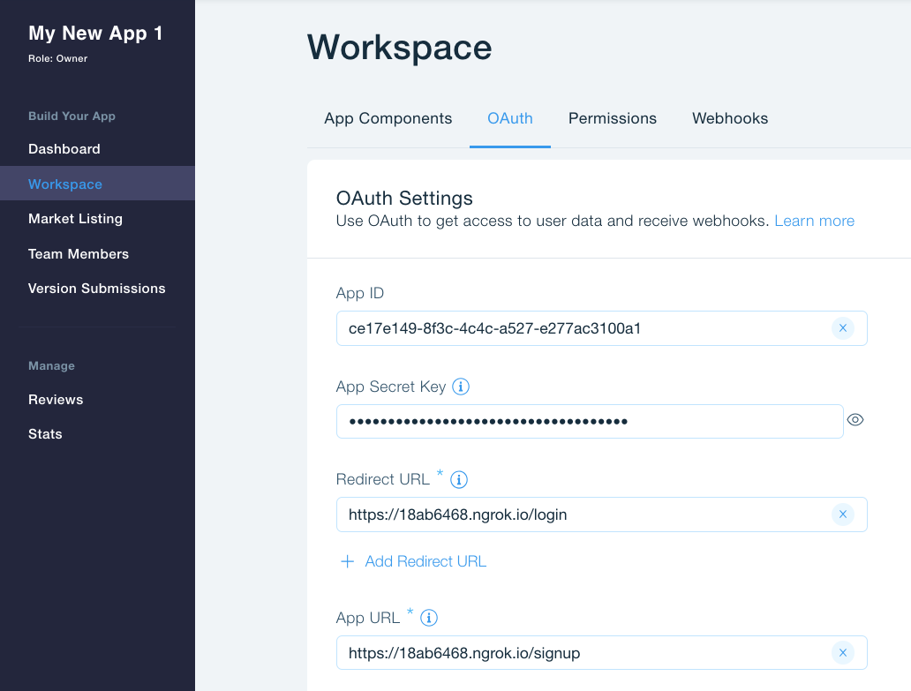

D. Click Save.

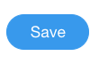

## 4. Register your application to receive your first webhook
A. Go to Workspace > Webhooks and add a new webhook.

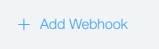

B. Select the wix_developers category and the APP_PROVISIONED_WEBHOOK event.

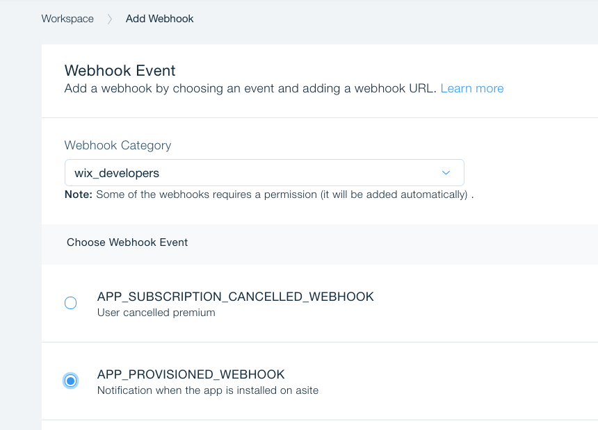

C. Set up the webhook callback URL to https://<12345678>.ngrok.io/webhook-callback.

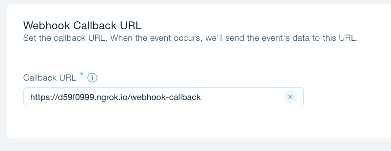  

**Remember to replace '12345678' with ** your ngrok string you got above.**

D. Click Save.
Now you should see your Public key on the bottom of the screen. copy your `Public key`. You will need it later.

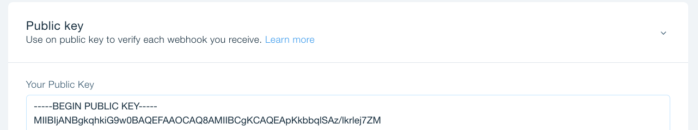

## 5. Create and run your app

A. Download and install [npm](https://www.npmjs.com/get-npm)

B. Clone the [Wix Sample Application](https://github.com/shaykewix/sample-wix-rest-app) to your machine

C. In the **config.js file (in the `src` folder)**: 
 - find and replace the APP_ID with the value you copied from Wix Developers:
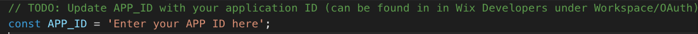   
 -  find and replace the PUBLIC_KEY with the value you copied from Wix Developers:
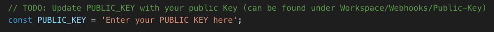  

D. In the **credentials.js file (in the `src` folder)** find and replace the APP_SECRET  with the value you copied from Wix Developers:

E. Run your app

* Browse to the cloned sample application
* Run `npm install`
* Run `npm build`
* Run `npm start`

You should get something like this:

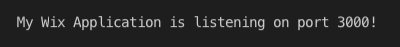

Well done! Now it's time to make sure your app works as expected.

## 6. Test your app

A. Click `Test Your App`
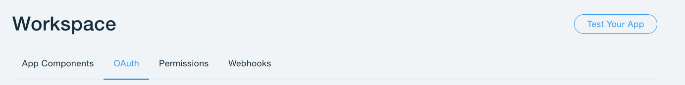

B. Select a site and click `Test Your App`

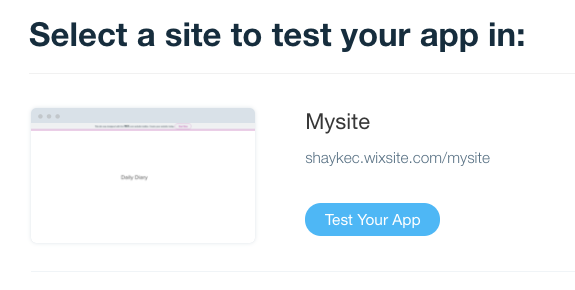

C. When prompted, click `Add To Site`:

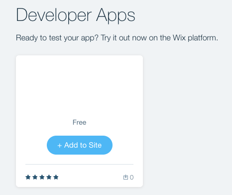

D. Provide consent for the app to collect data by clicking `Allow and Install`:

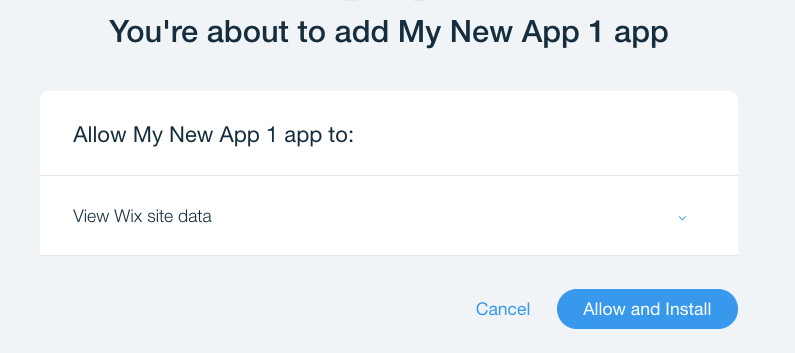

E. You should get a print into the browser with your application ID and your site instance ID:
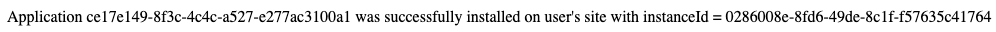

# Congrats, you're done!
## Now you can add your Application logic and Other WIX APIs.
